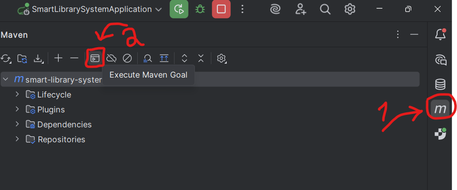
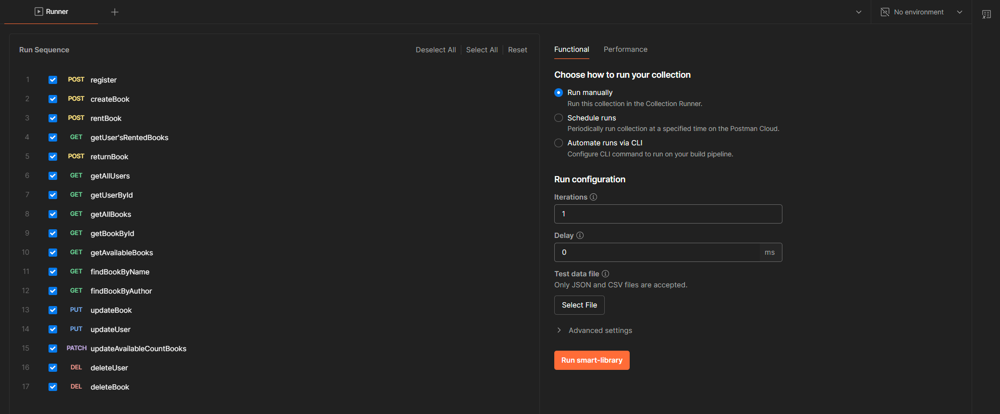
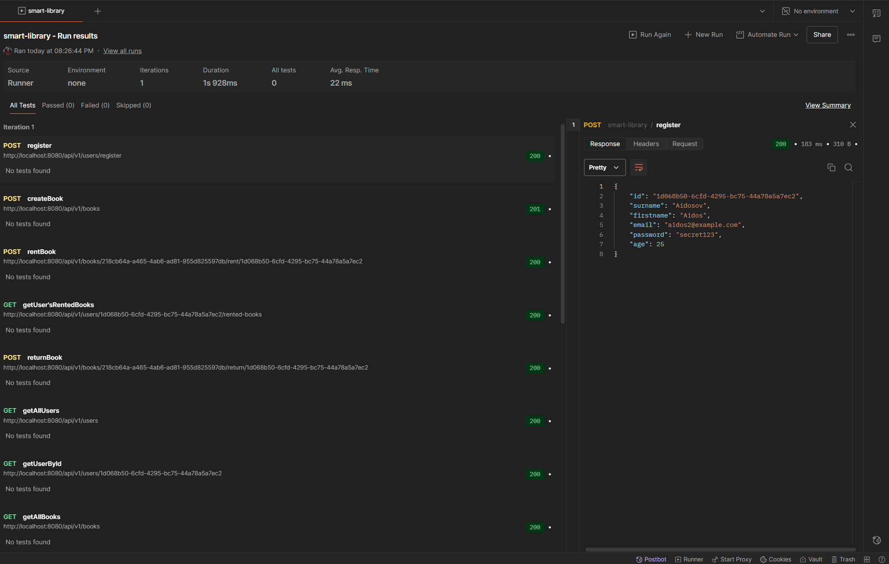

# Smart Library System

## Adina Meiramkhanova

### Software that must be installed on your computer 

1. IntelliJ IDEA (preferably Ultimate edition, because there is a Maven Plugin there) (https://www.jetbrains.com/idea/download/?section=windows)
2. Postman (https://www.postman.com/downloads/) 
3. Java Development Kit 21 (You can setup JDK in Intellij IDEA)

### Explaining how to run the code

1. Open project in IntelliJ IDEA
2. Wait until maven downloads all the dependencies and performs indexing
3. If you have problems downloading packages, you can use the ```` mvn clean install ```` and ```` mvn clean package ```` commands.
4. Make sure that other processes do not occupy port localhost:8080
5. Click on the green arrow (Run Button) or Open the maven plugin window (screenshot below) and write ```` mvn spring-boot:run  ```` (in Maven Console)
   
6. Wait until the log appears ```` Started SmartLibrarySystemApplication in 0.37 seconds (process running for 316.916) ````

### Explaining how Test endpoints
1. Download the file ```` smart_library_25MD0278_Meiramkhanva_Adina_postman_collection.json ```` (it is in the .zip file)
2. Open Postman
3. Click the ```` Import ```` button (near the top left corner)
4. Select the file you downloaded
5. Wait until the collection is imported
6. Press the ``` ... ``` near the collection name and select ``` Run ``` button
7. You will see the list of Endpoints:
   
8. Make sure you see the same settings for Runner as in the screenshot above
9. Click the ``` Run smart-library ``` button (orange button)
10. You can click on any endpoint separately and see its request & response in more detail.
    
